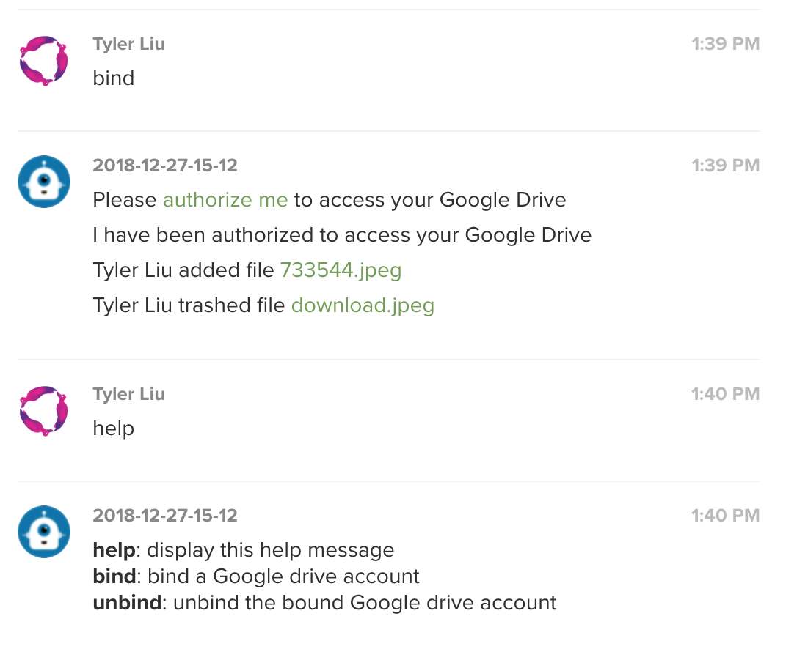

# Glip Google Drive Chatbot

This chatbot can notify you when there are changes in your Google Drive.




## Setup

Read [this tutorial](https://github.com/tylerlong/glip-ping-chatbot/tree/express) if you haven't done so.
The tutorial includes all the steps necessary to create a brand new chatbot.
You don't have to follow all the steps because you only need to setup this chatbot instead of creating a new one.

```
yarn install
yarn ngrok
```

Create `.env` file using [.env.sample](.env.sample) as template.


```
yarn start
curl -X PUT -u <admin>:<password> https://<chatbot-server>/admin/setup-database
```
